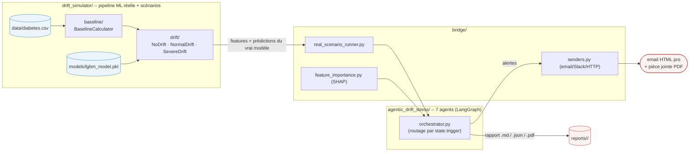

# Drift monitoring pour le modèle Pima Diabetes -- pipeline réelle + agents

Ce dépôt fait deux choses qui se branchent l'une sur l'autre :

1. **`drift_simulator/`** entraîne/sert un vrai modèle LightGBM sur le
   Pima Indians Diabetes Dataset, et sait **simuler** trois scénarios de
   dérive des données (aucune, modérée, sévère) sur ce vrai pipeline --
   utile pour stress-tester le monitoring avant qu'un vrai incident arrive.
2. **`agentic_drift_stress/`** est un système de **7 agents** (LangGraph)
   qui surveille ce modèle en continu : détection de drift, corrélation
   avec l'impact réel sur le modèle (SHAP), détection de dégradation de
   performance, recherche de cause racine, alerting, décision de
   remédiation, et rapport de diagnostic persisté (Markdown/JSON/PDF).

`bridge/` connecte les deux : il fait tourner les vrais simulateurs de
`drift_simulator/` et transmet leurs résultats aux agents de
`agentic_drift_stress/` comme s'ils observaient un modèle en production.

## Vue d'ensemble



## Dossier par dossier -- documentation détaillée

| Dossier | Rôle | Documentation |
|---|---|---|
| `drift_simulator/baseline/` | Calcule et met en cache la distribution de référence (baseline) utilisée par tout le reste comme étalon PSI. | [`drift_simulator/baseline/README.md`](drift_simulator/baseline/README.md) |
| `drift_simulator/drift/` | Génère les 3 scénarios de dérive (aucune / modérée / sévère) sur le vrai pipeline + le vrai modèle. | [`drift_simulator/drift/README.md`](drift_simulator/drift/README.md) |
| `agentic_drift_stress/` | Les 7 agents de monitoring (détection, diagnostic, alerting, remédiation, rapport). | [`agentic_drift_stress/README.md`](agentic_drift_stress/README.md) |
| *(racine)* | Historique technique complet (bugs trouvés, fixes, preuves de vérification). | [`AUDIT_LOG.md`](AUDIT_LOG.md) |

Chaque README ci-dessus est autonome (diagramme + explication + comment le
lancer isolément) -- celui-ci ne fait que les relier entre eux.

## Structure du dépôt

```
.
├── drift_simulator/
│   ├── baseline/            <- référence PSI, cache, validation de schéma (voir son README)
│   ├── drift/                <- scénarios no/normal/severe_drift (voir son README)
│   ├── feature_store/         <- feature store offline/online (voir feature_store_demo.py)
│   ├── src/                    <- pipeline ML "métier" (preprocessing, feature engineering, modeling)
│   ├── config/                  <- toute la config YAML (aucun seuil/chemin en dur dans le code)
│   ├── models/lgbm_model.pkl     <- le vrai modèle entraîné
│   └── data/diabetes.csv          <- Pima Indians Diabetes Dataset
├── agentic_drift_stress/     <- les 7 agents LangGraph (voir son README)
├── bridge/
│   ├── real_scenario_runner.py   <- instancie les VRAIS simulateurs, extrait
│   │                                 les prédictions par échantillon du vrai modèle
│   ├── feature_importance.py     <- contexte SHAP (feature intelligence)
│   └── senders.py                <- toutes les factories de sender AlertDispatcher
│                                     (fichier/HTTP local + Slack/SMTP réels)
├── run_scenario.py            <- point d'entrée : lance un scénario + envoie le rapport par email
├── mock_alert_server.py       <- serveur FastAPI local pour simuler la réception d'alertes
├── test_no_drift.py / test_normal_drift.py / test_severe_drift.py   <- démos end-to-end
├── tests/                      <- suite pytest (26 tests, régressions couvertes)
└── requirements.txt
```

## Installation

```bash
pip install -r requirements.txt
```

## Lancer les 3 scénarios

```bash
python3 test_no_drift.py
python3 test_normal_drift.py
python3 test_severe_drift.py
```

Chaque script fait tourner le vrai pipeline (`drift_simulator/`), transmet
les résultats aux 7 agents (`agentic_drift_stress/`), affiche le résumé dans
le terminal, et écrit un rapport de diagnostic complet (Markdown + JSON +
PDF) sous `reports/<model_id>/`.

Résultats obtenus (pipeline réelle, vérifiés dans cet environnement) :

| Scénario | Statut natif (`drift_simulator`) | Sévérité (`agentic_drift_stress`) | Alertes |
|---|---|---|---|
| `no_drift` | OK | `DriftSeverity.NONE` | 0 |
| `normal_drift` | WARNING | `DriftSeverity.CRITICAL` | 6 (data_drift ×4, performance_drift, root_cause) |
| `severe_drift` | severe (SLA respecté) | `DriftSeverity.CRITICAL` | 9 (dont 1 `PAGE`) |

> Pourquoi `drift_simulator` dit WARNING et `agentic_drift_stress` dit
> CRITICAL sur le même scénario `normal_drift` : les deux ont chacun leur
> propre implémentation de seuils PSI -- **attendu**, voir
> [`drift_simulator/drift/README.md`](drift_simulator/drift/README.md) et
> [`agentic_drift_stress/README.md`](agentic_drift_stress/README.md).

Accuracy du vrai modèle LightGBM sur la baseline : **0.935** (F1 = 0.906).

## Serveur d'alertes FastAPI (optionnel) -- toujours une SIMULATION

```bash
uvicorn mock_alert_server:app --port 8000
```

`run_scenario.py` détecte automatiquement le serveur (`GET /health`) et
envoie les alertes CRITICAL **aussi** par HTTP (`POST /email`), en plus du
fichier local `email_alert_log.jsonl`. Ceci reste une simulation : aucun
email n'est réellement livré, même avec ce serveur -- il journalise juste
la requête HTTP reçue.

Endpoints : `POST /email`, `POST /slack`, `GET /alerts`, `DELETE /alerts`, `GET /health`.

## Envoyer un VRAI email (SMTP)

```bash
export SMTP_HOST=smtp.gmail.com
export SMTP_PORT=587
export SMTP_USER=vous@gmail.com
export SMTP_PASSWORD=xxxx-xxxx-xxxx-xxxx   # mot de passe d'application Gmail, pas votre mdp normal
export ALERT_EMAIL_FROM=vous@gmail.com
export ALERT_EMAIL_TO=ml-oncall@votreentreprise.com

python3 test_severe_drift.py
```

`bridge/senders.py` détecte automatiquement `SMTP_HOST` -- priorité sur le
mock FastAPI et le fichier local (les deux restent actifs en parallèle pour
la traçabilité). Chaque alerte part en HTML (badge + couleur par priorité),
et le résumé exécutif de fin de cycle part avec le rapport de diagnostic
complet **en pièce jointe PDF**.


