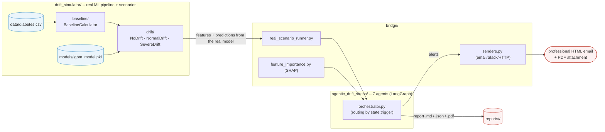

# Drift monitoring for the Pima Diabetes model -- real pipeline + agents

This repository does two things that plug into each other:

1. **`drift_simulator/`** trains/serves a real LightGBM model on the
   Pima Indians Diabetes Dataset, and can **simulate** three data drift
   scenarios (none, moderate, severe) on this real pipeline -- useful
   for stress-testing monitoring before a real incident happens.
2. **`agentic_drift_stress/`** is a **7-agent** system (LangGraph)
   that monitors this model continuously: drift detection, correlation
   with the real impact on the model (SHAP), performance degradation
   detection, root cause investigation, alerting, remediation
   decision-making, and a persisted diagnostic report (Markdown/JSON/PDF).

`bridge/` connects the two: it runs the real simulators from
`drift_simulator/` and forwards their results to the agents in
`agentic_drift_stress/` as if they were observing a model in production.

## Overview



## Folder by folder -- detailed documentation

| Folder | Role | Documentation |
|---|---|---|
| `drift_simulator/baseline/` | Computes and caches the reference distribution (baseline) used by everything else as the PSI benchmark. | [`drift_simulator/baseline/README.md`](drift_simulator/baseline/README.md) |
| `drift_simulator/drift/` | Generates the 3 drift scenarios (none / moderate / severe) on the real pipeline + the real model. | [`drift_simulator/drift/README.md`](drift_simulator/drift/README.md) |
| `agentic_drift_stress/` | The 7 monitoring agents (detection, diagnosis, alerting, remediation, reporting). | [`agentic_drift_stress/README.md`](agentic_drift_stress/README.md) |
| *(root)* | Complete technical history (bugs found, fixes, verification evidence). | [`AUDIT_LOG.md`](AUDIT_LOG.md) |

Each README above is self-contained (diagram + explanation + how to run
it in isolation) -- this one only links them together.

## Repository structure

```
.
├── drift_simulator/
│   ├── baseline/            <- PSI reference, cache, schema validation (see its README)
│   ├── drift/                <- no/normal/severe_drift scenarios (see its README)
│   ├── feature_store/         <- offline/online feature store (see feature_store_demo.py)
│   ├── src/                    <- "business" ML pipeline (preprocessing, feature engineering, modeling)
│   ├── config/                  <- all YAML config (no threshold/path hardcoded in the code)
│   ├── models/lgbm_model.pkl     <- the real trained model
│   └── data/diabetes.csv          <- Pima Indians Diabetes Dataset
├── agentic_drift_stress/     <- the 7 LangGraph agents (see its README)
├── bridge/
│   ├── real_scenario_runner.py   <- instantiates the REAL simulators, extracts
│   │                                 per-sample predictions from the real model
│   ├── feature_importance.py     <- SHAP context (feature intelligence)
│   └── senders.py                <- all AlertDispatcher sender factories
│                                     (local file/HTTP + real Slack/SMTP)
├── run_scenario.py            <- entry point: runs a scenario + emails the report
├── mock_alert_server.py       <- local FastAPI server to simulate alert reception
├── test_no_drift.py / test_normal_drift.py / test_severe_drift.py   <- end-to-end demos
├── tests/                      <- pytest suite (26 tests, regressions covered)
└── requirements.txt
```

## Installation

```bash
pip install -r requirements.txt
```

## Running the 3 scenarios

```bash
python3 test_no_drift.py
python3 test_normal_drift.py
python3 test_severe_drift.py
```

Each script runs the real pipeline (`drift_simulator/`), forwards the
results to the 7 agents (`agentic_drift_stress/`), prints a summary to
the terminal, and writes a full diagnostic report (Markdown + JSON +
PDF) under `reports/<model_id>/`.

Results obtained (real pipeline, verified in this environment):

| Scenario | Native status (`drift_simulator`) | Severity (`agentic_drift_stress`) | Alerts |
|---|---|---|---|
| `no_drift` | OK | `DriftSeverity.NONE` | 0 |
| `normal_drift` | WARNING | `DriftSeverity.CRITICAL` | 6 (data_drift ×4, performance_drift, root_cause) |
| `severe_drift` | severe (SLA met) | `DriftSeverity.CRITICAL` | 9 (including 1 `PAGE`) |

> Why `drift_simulator` says WARNING and `agentic_drift_stress` says
> CRITICAL on the same `normal_drift` scenario: each has its own
> implementation of PSI thresholds -- **expected**, see
> [`drift_simulator/drift/README.md`](drift_simulator/drift/README.md) and
> [`agentic_drift_stress/README.md`](agentic_drift_stress/README.md).

Real LightGBM model accuracy on the baseline: **0.935** (F1 = 0.906).

## FastAPI alert server (optional) -- always a SIMULATION

```bash
uvicorn mock_alert_server:app --port 8000
```

`run_scenario.py` automatically detects the server (`GET /health`) and
**also** sends CRITICAL alerts via HTTP (`POST /email`), in addition to
the local `email_alert_log.jsonl` file. This remains a simulation: no
email is actually delivered, even with this server -- it just logs the
HTTP request received.

Endpoints: `POST /email`, `POST /slack`, `GET /alerts`, `DELETE /alerts`, `GET /health`.

## Sending a REAL email (SMTP)

```bash
export SMTP_HOST=smtp.gmail.com
export SMTP_PORT=587
export SMTP_USER=you@gmail.com
export SMTP_PASSWORD=xxxx-xxxx-xxxx-xxxx   # Gmail app password, not your regular password
export ALERT_EMAIL_FROM=you@gmail.com
export ALERT_EMAIL_TO=ml-oncall@yourcompany.com

python3 test_severe_drift.py
```

`bridge/senders.py` automatically detects `SMTP_HOST` -- taking priority
over the mock FastAPI server and the local file (both stay active in
parallel for traceability). Each alert goes out as HTML (badge + color
by priority), and the end-of-cycle executive summary goes out with the
full diagnostic report **attached as a PDF**.

## Technical history

All bugs found, fixes applied, and verification evidence (tests, real
runs) are in [`AUDIT_LOG.md`](AUDIT_LOG.md) -- kept separate from this
README so this one stays a project presentation, not a changelog to
scroll through.
