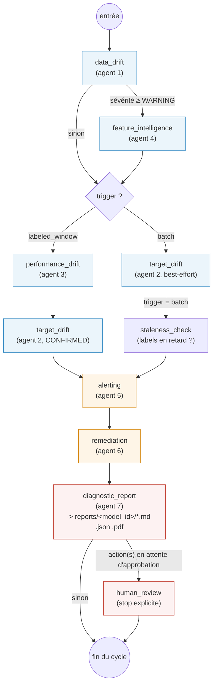
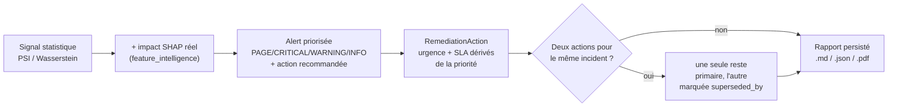

# `agentic_drift_stress/` -- les 7 agents de monitoring

> Fait partie de [l'application complète](../README.md). Ce dossier
> surveille un modèle en production ; il ne l'entraîne pas et ne simule
> aucun drift lui-même -- ça, c'est le rôle de
> [`drift_simulator/`](../drift_simulator/drift/README.md).

## En une phrase

Un graphe [LangGraph](https://langchain-ai.github.io/langgraph/) de 7 agents
qui transforme un flux de features/prédictions/labels en **une décision
opérationnelle claire** : rien à faire, surveiller, ouvrir un ticket,
retrain sous 24h, ou escalade immédiate -- avec, à chaque cycle, un rapport
complet et persisté qui explique le pourquoi.

## Les 7 agents

| # | Fichier | Rôle |
|---|---|---|
| 1 | `drift_detector.py` | Détecte le drift statistique sur les features numériques/catégorielles (PSI + distance de Wasserstein normalisée). Moteur générique, réutilisé aussi par `target_drift_agent.py`. |
| 2 | `target_drift_agent.py` | Applique le même moteur à la variable cible (y), en gérant le décalage temporel : vraies étiquettes (CONFIRMED) vs prédictions en attendant (PROXY) vs rien d'exploitable (PENDING). |
| 3 | `performance_drift_agent.py` | Compare les métriques de performance (accuracy, recall par classe, calibration...) sur une fenêtre glissante à une baseline gelée -- détecte une dégradation même sans drift statistique visible. |
| 4 | `feature_intelligence.py` | Croise le PSI avec l'importance SHAP réelle du modèle : une feature qui dérive fort mais que le modèle ignore n'est pas classée au même niveau qu'une feature qui dérive et pèse lourd dans les prédictions. |
| 5 | `alert_agent.py` | Le cerveau de la classification : transforme les rapports bruts des 4 agents ci-dessus en `Alert` priorisées (`PAGE`/`CRITICAL`/`WARNING`/`INFO`), avec un diagnostic écrit et une action recommandée -- inclut la corrélation "cause racine" (performance dégradée + feature à impact SHAP direct en drift = probable lien causal). |
| 6 | `remediation_agent.py` | Traduit chaque `Alert` en `RemediationAction` concrète : automatisable ou non, approbation humaine requise ou non, urgence/SLA, et détection des actions redondantes (`superseded_by`) quand deux alertes pointent vers le même incident. |
| 7 | `diagnostic_report.py` | Assemble tout ce qui précède (rien n'est recalculé) en **un seul rapport persisté** par cycle -- Markdown, JSON et PDF -- au lieu de logs/emails dispersés qu'on ne peut plus relire après coup. |

`orchestrator.py` n'est pas un 8e agent : c'est le graphe LangGraph qui les
relie tous, plus le state (`MonitoringState`) qu'ils se passent.

## Le graphe (`orchestrator.py::build_graph()`)



**Deux entrées possibles, un seul graphe** (`state["trigger"]`) :

- **`"batch"`** -- à chaque batch d'inférence : `data_drift` (+ `feature_intelligence`
  si le drift est significatif) + `target_drift` en mode best-effort (PROXY
  sur les prédictions, en attendant les vraies étiquettes) + `staleness_check`
  (le pipeline de labellisation est-il en panne ?).
- **`"labeled_window"`** -- dès qu'une fenêtre de vraies étiquettes est
  disponible (déclenché en externe, ex. Airflow) : `performance_drift` +
  `target_drift` CONFIRMED -- c'est ce chemin qui peut faire remonter une
  alerte `root_cause` (voir plus bas).

Les deux chemins convergent sur le même tronc commun : `alerting -> remediation
-> diagnostic_report -> [human_review] -> fin`.

## La chaîne de décision, de bout en bout

C'est la partie qui donne sa valeur au système : chaque étage **enrichit**
la décision de l'étage précédent, il ne se contente pas de la retransmettre.



Exemple concret (scénario `severe_drift`, voir
[racine du dépôt](../README.md)) : `Insulin` dérive fort (PSI=10.6) **et**
c'est la feature la plus importante du modèle (SHAP) -> `feature_intelligence`
la classe `critical` (alors que `BloodPressure`, PSI=3.75 mais sans
importance SHAP, est classée `ignore`) -> `alert_agent` corrèle ce drift
avec la dégradation de performance mesurée le même cycle -> une alerte
`root_cause` CRITICAL est émise, nommant `Insulin` explicitement -> côté
remédiation, cette action `RETRAIN` spécifique devient la seule primaire ;
l'alerte générique "dégradation de performance" (qui suggérait aussi un
retrain, mais sans savoir pourquoi) est marquée `superseded_by` -- un seul
retrain à approuver, pas deux demandes redondantes.

## `MonitoringState` -- ce qui circule dans le graphe

Chaque agent est **stateful** en interne (garde sa propre distribution de
référence, sa fenêtre glissante...) mais ces objets vivent dans un registre
process-local par `model_id`, **pas** dans le state LangGraph -- seuls des
résultats sérialisables y transitent :

| Champ | Posé par | Contenu |
|---|---|---|
| `trigger` | l'appelant | `"batch"` ou `"labeled_window"` |
| `data_drift_report` | `data_drift` | `DriftReport` (1 par feature suivie) |
| `combined_feature_verdicts` | `feature_intelligence` | verdict PSI × SHAP par feature |
| `target_drift_result` | `target_drift` | statut CONFIRMED/PROXY/PENDING + PSI sur y |
| `performance_drift_result` | `performance_drift` | métriques dégradées, cause probable |
| `_alert_objects` | `alerting` | `Alert` du cycle (objets bruts, pas juste `.to_dict()`) |
| `_remediation_action_objects` | `remediation` | `RemediationAction` du cycle |
| `report_path` / `report_pdf_path` | `diagnostic_report` | chemin disque du rapport (jamais le contenu lui-même dans le state checkpointé) |
| `pending_approval` | `remediation` | route vers `human_review` si une action mutante attend un humain |

## Lancer un cycle

En pratique, c'est [`run_scenario.py`](../run_scenario.py) (à la racine) qui
orchestre ça avec les vraies données de `drift_simulator/` -- voir le
[README principal](../README.md#lancer-les-3-scénarios). Pour appeler le
graphe directement :

```python
from orchestrator import build_graph

graph = build_graph()
state = graph.invoke(
    {"model_id": "pima_diabetes", "trigger": "batch", "features_df": df},
    config={"configurable": {"thread_id": "pima_diabetes"}},
)
print(state["report_pdf_path"])
```

## Note sur les seuils de sévérité

`drift_simulator` (le simulateur, voir son
[README](../drift_simulator/drift/README.md)) et `agentic_drift_stress`
(ce dossier) ont chacun leur **propre** implémentation de PSI et leurs
propres seuils -- c'est volontaire (le simulateur mesure sa propre SLA
interne, l'agent applique la politique de monitoring réelle) mais ça veut
dire que les deux peuvent classer le même scénario différemment. Sur
`normal_drift` par exemple : `WARNING` côté simulateur, `CRITICAL` côté
agent. Voir la docstring de `test_normal_drift.py` à la racine pour le
détail des seuils de chaque côté.
