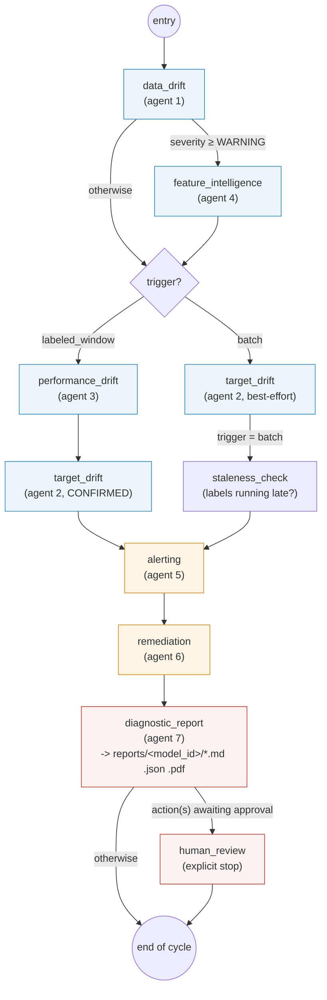
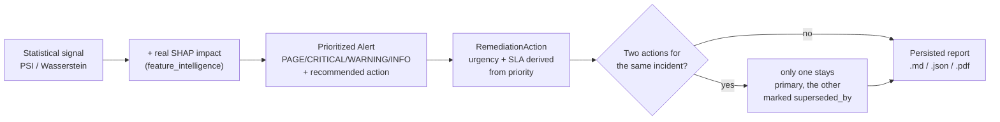

# `agentic_drift_stress/` -- the 7 monitoring agents

> Part of [the full application](../README.md). This folder monitors a
> model in production; it does not train it and does not simulate any
> drift itself -- that's the role of
> [`drift_simulator/`](../drift_simulator/drift/README.md).

## In one sentence

A [LangGraph](https://langchain-ai.github.io/langgraph/) graph of 7
agents that turns a stream of features/predictions/labels into **one
clear operational decision**: nothing to do, keep watching, open a
ticket, retrain within 24h, or escalate immediately -- with, on every
cycle, a full persisted report explaining the reasoning.

## The 7 agents

| # | File | Role |
|---|---|---|
| 1 | `drift_detector.py` | Detects statistical drift on numerical/categorical features (PSI + normalized Wasserstein distance). Generic engine, also reused by `target_drift_agent.py`. |
| 2 | `target_drift_agent.py` | Applies the same engine to the target variable (y), handling the temporal lag: real labels (CONFIRMED) vs predictions used in the meantime (PROXY) vs nothing usable (PENDING). |
| 3 | `performance_drift_agent.py` | Compares performance metrics (accuracy, per-class recall, calibration...) over a sliding window against a frozen baseline -- detects degradation even without visible statistical drift. |
| 4 | `feature_intelligence.py` | Crosses PSI with the model's actual SHAP importance: a feature that drifts strongly but that the model ignores is not classified at the same level as a feature that drifts and carries heavy weight in the predictions. |
| 5 | `alert_agent.py` | The brain of the classification: turns the raw reports from the 4 agents above into prioritized `Alert`s (`PAGE`/`CRITICAL`/`WARNING`/`INFO`), with a written diagnosis and a recommended action -- includes "root cause" correlation (degraded performance + a feature with direct SHAP impact that is drifting = likely causal link). |
| 6 | `remediation_agent.py` | Translates each `Alert` into a concrete `RemediationAction`: automatable or not, human approval required or not, urgency/SLA, and detection of redundant actions (`superseded_by`) when two alerts point to the same incident. |
| 7 | `diagnostic_report.py` | Assembles everything above (nothing is recomputed) into **a single persisted report** per cycle -- Markdown, JSON, and PDF -- instead of scattered logs/emails that can't be reread afterward. |

`orchestrator.py` is not an 8th agent: it's the LangGraph graph that
links them all together, plus the state (`MonitoringState`) they pass
between each other.

## The graph (`orchestrator.py::build_graph()`)



**Two possible entry points, a single graph** (`state["trigger"]`):

- **`"batch"`** -- on every inference batch: `data_drift` (+
  `feature_intelligence` if the drift is significant) + `target_drift`
  in best-effort mode (PROXY on predictions, while waiting for real
  labels) + `staleness_check` (is the labeling pipeline down?).
- **`"labeled_window"`** -- as soon as a window of real labels is
  available (triggered externally, e.g. by Airflow): `performance_drift`
  + `target_drift` CONFIRMED -- this is the path that can surface a
  `root_cause` alert (see below).

Both paths converge on the same common trunk: `alerting -> remediation
-> diagnostic_report -> [human_review] -> end`.

## The decision chain, end to end

This is the part that gives the system its value: each stage
**enriches** the previous stage's decision, it doesn't just pass it
along.



Concrete example (`severe_drift` scenario, see
[repository root](../README.md)): `Insulin` drifts strongly (PSI=10.6)
**and** it's the model's most important feature (SHAP) ->
`feature_intelligence` classifies it as `critical` (whereas
`BloodPressure`, PSI=3.75 but with no SHAP importance, is classified as
`ignore`) -> `alert_agent` correlates this drift with the performance
degradation measured in the same cycle -> a `root_cause` CRITICAL alert
is emitted, explicitly naming `Insulin` -> on the remediation side, this
specific `RETRAIN` action becomes the sole primary one; the generic
"performance degradation" alert (which also suggested a retrain, but
without knowing why) is marked `superseded_by` -- a single retrain to
approve, not two redundant requests.

## `MonitoringState` -- what flows through the graph

Each agent is **stateful** internally (keeps its own reference
distribution, its own sliding window...) but these objects live in a
process-local registry keyed by `model_id`, **not** in the LangGraph
state -- only serializable results pass through it:

| Field | Set by | Content |
|---|---|---|
| `trigger` | the caller | `"batch"` or `"labeled_window"` |
| `data_drift_report` | `data_drift` | `DriftReport` (1 per tracked feature) |
| `combined_feature_verdicts` | `feature_intelligence` | PSI × SHAP verdict per feature |
| `target_drift_result` | `target_drift` | CONFIRMED/PROXY/PENDING status + PSI on y |
| `performance_drift_result` | `performance_drift` | degraded metrics, probable cause |
| `_alert_objects` | `alerting` | this cycle's `Alert`s (raw objects, not just `.to_dict()`) |
| `_remediation_action_objects` | `remediation` | this cycle's `RemediationAction`s |
| `report_path` / `report_pdf_path` | `diagnostic_report` | on-disk path of the report (never the content itself in the checkpointed state) |
| `pending_approval` | `remediation` | routes to `human_review` if a mutating action is awaiting a human |

## Running a cycle

In practice, it's [`run_scenario.py`](../run_scenario.py) (at the root)
that orchestrates this with the real data from `drift_simulator/` -- see
the [main README](../README.md#running-the-3-scenarios). To call the
graph directly:

```python
from orchestrator import build_graph

graph = build_graph()
state = graph.invoke(
    {"model_id": "pima_diabetes", "trigger": "batch", "features_df": df},
    config={"configurable": {"thread_id": "pima_diabetes"}},
)
print(state["report_pdf_path"])
```

## Note on severity thresholds

`drift_simulator` (the simulator, see its
[README](../drift_simulator/drift/README.md)) and `agentic_drift_stress`
(this folder) each have their **own** PSI implementation and their own
thresholds -- this is intentional (the simulator measures its own
internal SLA, the agent applies the actual monitoring policy) but it
means the two can classify the same scenario differently. On
`normal_drift`, for example: `WARNING` on the simulator side, `CRITICAL`
on the agent side. See the docstring of `test_normal_drift.py` at the
root for the threshold details on each side.
