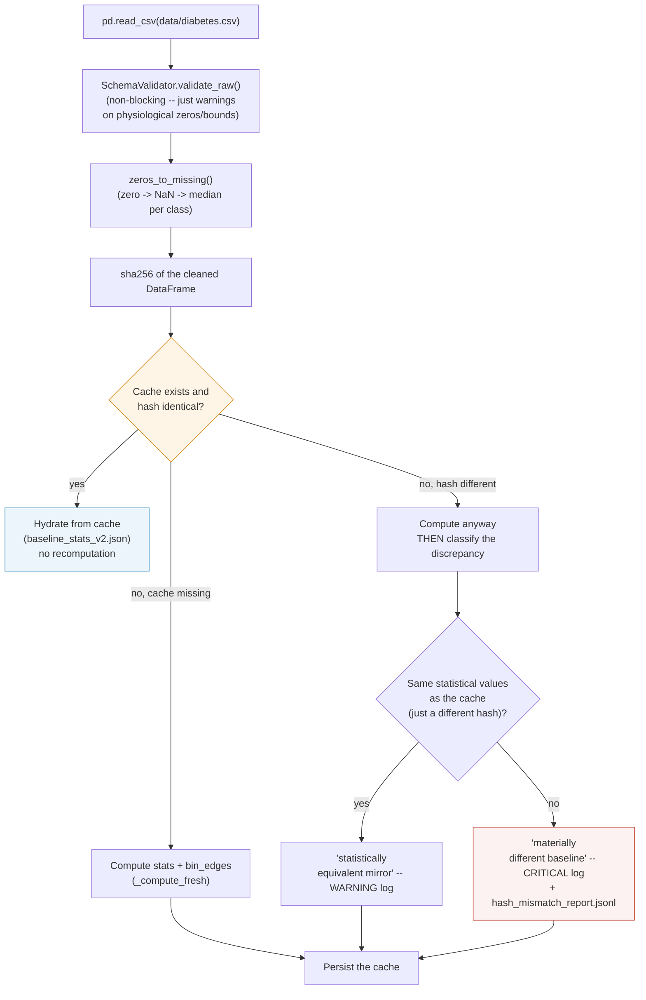

# `drift_simulator/baseline/` -- the reference everything is compared against

> Part of [the full application](../../README.md). This folder doesn't
> detect anything itself: it computes and serves the reference
> distribution that [`../drift/`](../drift/README.md) and the 7 agents
> in [`agentic_drift_stress/`](../../agentic_drift_stress/README.md) use
> as the PSI benchmark.

## In one sentence

`BaselineCalculator` loads `data/diabetes.csv`, cleans it (biologically
impossible zeros → missing → median), computes descriptive statistics +
a **frozen** PSI bin grid per feature, and caches all of it on disk --
so the reference never has to be recomputed for every scenario.
`SchemaValidator` performs an additional non-blocking quality check.

## Why a frozen bin grid

PSI compares two histograms built on **the same bin boundaries**. If the
bins were recomputed on the current data at every call, a massive drift
would widen the grid itself and absorb part of the very signal it's
meant to detect. `bin_edges` is therefore computed **once**, from the
baseline's quantiles, with open outer bounds (`-inf`/`+inf`) to capture
any shift even outside the initially observed range -- and is never
recomputed afterward.

## Lifecycle of `load_or_compute()`



This safeguard exists because a different hash can have two very
different causes: a simple row reordering in the source CSV (harmless),
or an actual drift in the reference itself -- which would be serious,
since all downstream PSI decisions depend on this baseline being
trustworthy. Silently regenerating the cache in both cases used to mask
this second case; it is now explicitly classified and logged at the
right level.

## Persisted files

| File | Content | Regenerated when |
|---|---|---|
| `baseline/.cache/baseline_stats_v2.json` | `baseline_stats` (mean/std/min/max/quartiles per feature) + `bin_edges` (frozen PSI grid) + `baseline_reference` (path, hash, date) | Hash of the cleaned CSV differs from the cache |
| `baseline/.cache/hash_mismatch_report.jsonl` | One line per detected hash divergence, with its classification (mirror vs materially different) | On every divergence (append-only, never overwritten) |

## `SchemaValidator` -- quality check, never blocking

Compares the raw CSV against the bounds documented in
`config/diabetes_schema.yaml` (physiological min/max, `zero_is_missing`
per column) and returns a list of violations **as text**, never an
exception: in a drift stress test, exceeding the baseline's bounds is
the **expected** behavior in `severe`/`extreme` scenarios, not an
application bug.

It also serves as the source of truth for the exact column order
expected by the model (`expected_model_columns()`, read from
`config/performance.yaml` -> `booster_info.feature_names`) -- used by
`drift/base_drift_simulator.py` so it never has to depend on
`model.feature_name_` (absent depending on the loaded model type, e.g.
`VotingClassifier`).

## PSI -- shared formula, not duplicated

`BaselineCalculator.compute_psi()` delegates to
`psi_common.psi_from_counts()` (repository root) -- **the same function**
that
[`agentic_drift_stress/drift_detector.py`](../../agentic_drift_stress/README.md)
uses to compute its own PSI. Before unification (see
[`../../AUDIT_LOG.md`](../../AUDIT_LOG.md)), the two sub-projects each
had their own formula, with results that could diverge on the same data
-- `tests/test_psi_common.py` locks in this identity.

## Direct usage

```python
from baseline.baseline_calculator import BaselineCalculator

bc = BaselineCalculator(config_path="config/baseline_config.yml")
bc.load_or_compute()

psi = bc.compute_psi(current_batch["Glucose"], "Glucose")
stats = bc.get_stats("Glucose")  # mean/std/min/max/q1/q3/iqr
columns = bc.expected_model_columns()  # exact order expected by the model
```
