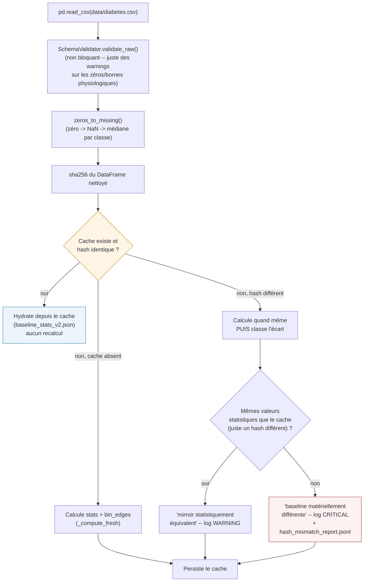

# `drift_simulator/baseline/` -- la référence contre laquelle tout se compare

> Fait partie de [l'application complète](../../README.md). Ce dossier ne
> détecte rien lui-même : il calcule et sert la distribution de référence
> que [`../drift/`](../drift/README.md) et les 7 agents de
> [`agentic_drift_stress/`](../../agentic_drift_stress/README.md) utilisent
> comme étalon PSI.

## En une phrase

`BaselineCalculator` charge `data/diabetes.csv`, le nettoie (zéros
biologiquement impossibles → manquants → médiane), calcule des statistiques
descriptives + une grille de bins PSI **figée** par feature, et met tout ça
en cache sur disque -- pour ne jamais recalculer la référence à chaque
scénario. `SchemaValidator` fait un contrôle qualité non bloquant en plus.

## Pourquoi une grille de bins figée

Le PSI compare deux histogrammes construits sur **les mêmes bornes de
bins**. Si les bins étaient recalculés sur les données courantes à chaque
appel, un drift massif élargirait la grille elle-même et absorberait une
partie du signal qu'on cherche justement à détecter. `bin_edges` est donc
calculé **une fois**, à partir des quantiles de la baseline, avec les bornes
extérieures ouvertes (`-inf`/`+inf`) pour capturer tout décalage même hors
de la plage observée au départ -- et n'est plus jamais recalculé après.

## Cycle de vie de `load_or_compute()`



Ce garde-fou existe parce qu'un hash différent peut avoir deux causes très
différentes : un simple réordonnancement de lignes dans le CSV source (sans
conséquence), ou une vraie dérive de la référence elle-même -- ce qui serait
grave, puisque toutes les décisions PSI en aval dépendent de cette baseline
étant fiable. Regénérer silencieusement le cache dans les deux cas masquait
ce deuxième cas ; il est maintenant explicitement classé et loggué au bon
niveau.

## Fichiers persistés

| Fichier | Contenu | Régénéré quand |
|---|---|---|
| `baseline/.cache/baseline_stats_v2.json` | `baseline_stats` (mean/std/min/max/quartiles par feature) + `bin_edges` (grille PSI figée) + `baseline_reference` (chemin, hash, date) | Hash du CSV nettoyé différent du cache |
| `baseline/.cache/hash_mismatch_report.jsonl` | Une ligne par divergence de hash détectée, avec sa classification (mirroir vs matériellement différent) | À chaque divergence (append-only, jamais écrasé) |

## `SchemaValidator` -- contrôle qualité, jamais bloquant

Compare le CSV brut aux bornes documentées dans `config/diabetes_schema.yaml`
(min/max physiologiques, `zero_is_missing` par colonne) et renvoie une liste
de violations **en texte**, jamais une exception : dans un stress-test de
drift, sortir des bornes de la baseline est le comportement **attendu** en
scénario `severe`/`extreme`, pas un bug applicatif.

Sert aussi de source de vérité pour l'ordre exact des colonnes attendu par
le modèle (`expected_model_columns()`, lu depuis
`config/performance.yaml` -> `booster_info.feature_names`) -- utilisé par
`drift/base_drift_simulator.py` pour ne jamais dépendre de
`model.feature_name_` (absent selon le type de modèle chargé, ex.
`VotingClassifier`).

## PSI -- formule partagée, pas dupliquée

`BaselineCalculator.compute_psi()` délègue à `psi_common.psi_from_counts()`
(racine du dépôt) -- **la même fonction** que
[`agentic_drift_stress/drift_detector.py`](../../agentic_drift_stress/README.md)
utilise pour calculer son propre PSI. Avant l'unification (voir
[`../../AUDIT_LOG.md`](../../AUDIT_LOG.md)), les deux sous-projets avaient
chacun leur formule, avec des résultats qui pouvaient diverger sur les
mêmes données -- `tests/test_psi_common.py` verrouille cette identité.

## Utilisation directe

```python
from baseline.baseline_calculator import BaselineCalculator

bc = BaselineCalculator(config_path="config/baseline_config.yml")
bc.load_or_compute()

psi = bc.compute_psi(current_batch["Glucose"], "Glucose")
stats = bc.get_stats("Glucose")  # mean/std/min/max/q1/q3/iqr
columns = bc.expected_model_columns()  # ordre exact attendu par le modèle
```
