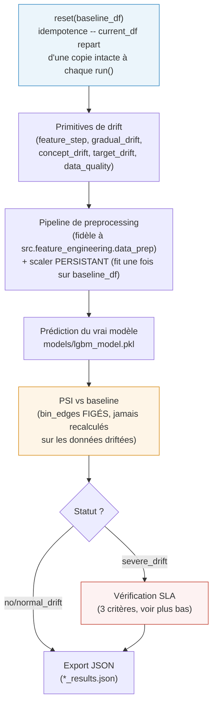

# `drift_simulator/drift/` -- scénarios de dérive sur le vrai pipeline

> Fait partie de [l'application complète](../../README.md). Ce dossier
> **injecte** du drift dans une copie de la baseline pour tester le
> monitoring en amont d'un vrai incident. La référence contre laquelle il
> compare vient de [`../baseline/`](../baseline/README.md).

## En une phrase

Trois scénarios (`NoDriftSimulator`, `NormalDriftSimulator`,
`SevereDriftSimulator`), tous héritant de `BaseDriftSimulator`, qui
modifient une copie de la baseline (features, distribution de la cible,
qualité des données), font passer ce batch modifié dans le **vrai**
pipeline de preprocessing + le **vrai** modèle LightGBM, mesurent le PSI
résultant, et exportent un rapport JSON.

## Les 3 scénarios

| Scénario | Objectif | Primitives appliquées | Statut attendu |
|---|---|---|---|
| `NoDriftSimulator` | Contrôle négatif -- baseline strictement inchangée. Un `NoDriftSimulator` qui ne renvoie pas `OK` révèle un bug du pipeline, pas un problème de données. | Aucune | `OK` |
| `NormalDriftSimulator` | Drift "business as usual" modéré, doit déclencher un `WARNING`, pas une alerte critique. | Décalage léger de features (~0.5σ) | `WARNING` |
| `SevereDriftSimulator` | Drift extrême/composite, doit déclencher `CRITICAL` + respecter une SLA de détection précise (voir plus bas). | Toutes les primitives ci-dessous, cumulées | `severe` (SLA vérifiée) |

Les presets `severe`/`extreme` (deltas exacts par feature) sont dans
`config/baseline_config.yml` (section `severity_presets`) -- **rien n'est en
dur dans le code**, un scénario ne fait qu'appliquer la config qu'on lui
passe.

## Les primitives de drift (composables, utilisées par `severe`/`extreme`)

| Primitive | Effet |
|---|---|
| `feature_step` | Décalage brutal d'une feature (ex. `Glucose += 80`), appliqué à une fraction `mask_ratio` des lignes. |
| `feature_variance_shift` | Multiplie l'écart-type d'une feature par un facteur (`BloodPressure × 2.5`) -- drift de dispersion, pas de moyenne. |
| `gradual_drift` (générateur) | Dérive progressive sur `n_batches` étapes cumulatives (`Insulin`, delta total réparti + bruit) -- simule une dérive lente plutôt qu'un saut. |
| `concept_drift` | Change la règle qui définit `Outcome` (nouveau seuil de décision) **et** ajoute du bruit d'étiquetage -- le lien X→y change, pas seulement X. |
| `target_drift` (resampling) | Change la prévalence de la classe positive par sur-échantillonnage. |
| `data_quality` | Injecte des outliers et des valeurs manquantes à des taux contrôlés -- teste la robustesse du preprocessing, pas juste la détection statistique. |

## Cycle de vie d'un scénario (`BaseDriftSimulator`)



Deux détails d'implémentation qui ont un vrai impact sur la fiabilité de la
mesure :

- **Scaler persistant, pas refit à chaque batch** -- `_ensure_persistent_scaler()`
  fit le `RobustScaler` **une seule fois** sur `baseline_df`, puis applique
  seulement `.transform()` sur chaque checkpoint driftée. Refit à chaque
  batch (ce que fait `src.feature_engineering.data_prep` tel quel) absorbe
  une partie du drift de dispersion dans la normalisation -- le simulateur
  resterait aveugle à sa propre injection. Comportement piloté par
  `preprocessing.scaler_mode` dans `baseline_config.yml`
  (`persistent_baseline_fit` recommandé vs `refit_per_batch` pour comparer).
- **Pas de fuite du label à l'inférence** -- `_prep_infer()` impute les
  zéros biologiquement impossibles avec des médianes **globales, gelées sur
  la baseline** (`_persistent_global_medians`), jamais avec la médiane
  conditionnelle au label (`Outcome`) comme le fait le pipeline
  d'entraînement -- sinon, scorer un batch de production reviendrait à
  utiliser l'étiquette qu'on est censé prédire.

## Vérification SLA (`SevereDriftSimulator` uniquement)

Le scénario `severe` doit non seulement atteindre `CRITICAL`, mais le faire
selon 3 critères précis (`_sla_check`), tous dans `baseline_config.yml` :

1. PSI de `Glucose` après `feature_step` > seuil minimum.
2. Taux de changement des prédictions du modèle > seuil minimum.
3. Dégradation du F1 > seuil minimum.

Si un seul de ces critères échoue, le rapport le documente explicitement
(`criteria_failed`) -- un `severe_drift` qui atteint `CRITICAL` "par
accident" sur un seul indicateur sans respecter la SLA complète est
considéré comme un signal moins fiable, pas comme un succès.

## Lancer isolément

```bash
cd drift_simulator
python3 run_drift.py
```

Exporte `no_drift_results.json` / `normal_drift_results.json` /
`severe_drift_severe_results.json` à la racine de `drift_simulator/`. Pour
les faire tourner à travers les 7 agents de monitoring plutôt qu'en
autonome, voir [`agentic_drift_stress/README.md`](../../agentic_drift_stress/README.md)
et [le README principal](../../README.md#lancer-les-3-scénarios).
