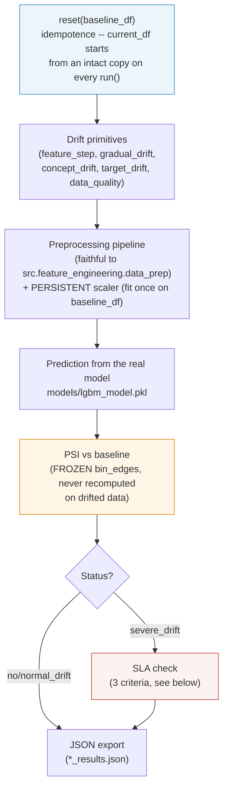

# `drift_simulator/drift/` -- drift scenarios on the real pipeline

> Part of [the full application](../../README.md). This folder
> **injects** drift into a copy of the baseline in order to test
> monitoring ahead of a real incident. The reference it compares
> against comes from [`../baseline/`](../baseline/README.md).

## In one sentence

Three scenarios (`NoDriftSimulator`, `NormalDriftSimulator`,
`SevereDriftSimulator`), all inheriting from `BaseDriftSimulator`, which
modify a copy of the baseline (features, target distribution, data
quality), pass this modified batch through the **real** preprocessing
pipeline + the **real** LightGBM model, measure the resulting PSI, and
export a JSON report.

## The 3 scenarios

| Scenario | Goal | Primitives applied | Expected status |
|---|---|---|---|
| `NoDriftSimulator` | Negative control -- baseline strictly unchanged. A `NoDriftSimulator` that doesn't return `OK` reveals a pipeline bug, not a data problem. | None | `OK` |
| `NormalDriftSimulator` | Moderate "business as usual" drift, should trigger a `WARNING`, not a critical alert. | Slight feature shift (~0.5σ) | `WARNING` |
| `SevereDriftSimulator` | Extreme/composite drift, should trigger `CRITICAL` + meet a precise detection SLA (see below). | All primitives below, combined | `severe` (SLA verified) |

The `severe`/`extreme` presets (exact per-feature deltas) are in
`config/baseline_config.yml` (`severity_presets` section) -- **nothing is
hardcoded in the code**, a scenario only applies the config it's given.

## Drift primitives (composable, used by `severe`/`extreme`)

| Primitive | Effect |
|---|---|
| `feature_step` | Abrupt shift of a feature (e.g. `Glucose += 80`), applied to a fraction `mask_ratio` of rows. |
| `feature_variance_shift` | Multiplies a feature's standard deviation by a factor (`BloodPressure × 2.5`) -- dispersion drift, not mean drift. |
| `gradual_drift` (generator) | Progressive drift over `n_batches` cumulative steps (`Insulin`, total delta spread out + noise) -- simulates a slow drift rather than a jump. |
| `concept_drift` | Changes the rule defining `Outcome` (new decision threshold) **and** adds label noise -- the X→y relationship changes, not just X. |
| `target_drift` (resampling) | Changes the prevalence of the positive class via oversampling. |
| `data_quality` | Injects outliers and missing values at controlled rates -- tests preprocessing robustness, not just statistical detection. |

## Lifecycle of a scenario (`BaseDriftSimulator`)



Two implementation details that genuinely matter for the reliability of
the measurement:

- **Persistent scaler, not refit on every batch** -- `_ensure_persistent_scaler()`
  fits the `RobustScaler` **only once** on `baseline_df`, then only
  applies `.transform()` on each drifted checkpoint. Refitting on every
  batch (which is what `src.feature_engineering.data_prep` does as-is)
  absorbs part of the dispersion drift into the normalization -- the
  simulator would end up blind to its own injection. This behavior is
  controlled by `preprocessing.scaler_mode` in `baseline_config.yml`
  (`persistent_baseline_fit` recommended vs `refit_per_batch` for
  comparison).
- **No label leakage at inference time** -- `_prep_infer()` imputes
  biologically impossible zeros with **global medians frozen on the
  baseline** (`_persistent_global_medians`), never with the label-
  conditional median (`Outcome`) as the training pipeline does --
  otherwise, scoring a production batch would amount to using the label
  it's supposed to predict.

## SLA verification (`SevereDriftSimulator` only)

The `severe` scenario must not only reach `CRITICAL`, but do so
according to 3 precise criteria (`_sla_check`), all defined in
`baseline_config.yml`:

1. `Glucose` PSI after `feature_step` above a minimum threshold.
2. Model prediction change rate above a minimum threshold.
3. F1 degradation above a minimum threshold.

If even one of these criteria fails, the report documents it explicitly
(`criteria_failed`) -- a `severe_drift` that reaches `CRITICAL` "by
accident" on a single indicator without meeting the full SLA is
considered a less reliable signal, not a success.

## Running it standalone

```bash
cd drift_simulator
python3 run_drift.py
```

Exports `no_drift_results.json` / `normal_drift_results.json` /
`severe_drift_severe_results.json` at the root of `drift_simulator/`. To
run these through the 7 monitoring agents rather than standalone, see
[`agentic_drift_stress/README.md`](../../agentic_drift_stress/README.md)
and [the main README](../../README.md#running-the-3-scenarios).
